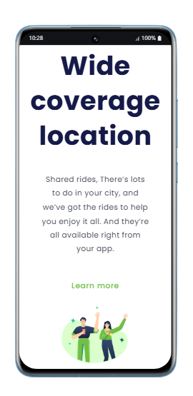

# 📱 Desafio CSS Parte 2 — Responsividade

Este projeto é parte de um desafio prático focado em aplicar **responsividade com CSS** em uma página web.  
A proposta é adaptar o layout para diferentes tamanhos de tela, utilizando **media queries**, **flexbox**, e boas práticas de design responsivo.

---
## 📸 Prévia visual



---
## 🎯 Objetivo

- Criar um layout que funcione bem em dispositivos móveis, tablets e desktops  
- Praticar o uso de CSS moderno para adaptação de conteúdo  
- Consolidar conhecimentos em estrutura HTML e estilização com CSS  

---

## 🛠 Tecnologias utilizadas

- **HTML5** → Estrutura semântica da página  
- **CSS3** → Estilização e responsividade  
- **Media Queries** → Adaptação do layout para diferentes resoluções  
- **Flexbox/Grid** → Organização dos elementos na tela  

---

## 📁 Estrutura do projeto

```plaintext
📁 Desafio-Css-pt2-Responsividade/
├── index.html        → Página principal
├── styles.css        → Estilos e media queries
└── assets/           → Imagens e recursos visuais
```

---
▶️ Como visualizar


Você pode executar o projeto localmente de forma simples, sem precisar instalar dependências ou configurar servidores. Basta seguir os passos abaixo:

🔧 Requisitos
Um navegador moderno (como Google Chrome, Firefox, Edge, etc.)

(Opcional) Um editor de código como Visual Studio Code para explorar e modificar os arquivos

---
📦 Passo a passo

 1 - Baixar o projeto
Você tem duas opções:

Via Git (recomendado):

```bash
git clone https://github.com/Klausdmkb/Desafio-Css-pt2-Responsividade.git
```

- Via ZIP
  
- Clique no botão verde Code no topo do repositório

- Selecione Download ZIP

- Extraia os arquivos em uma pasta local

2 - Abrir o projeto
Navegue até a pasta onde os arquivos foram salvos

- Dê dois cliques no arquivo index.html

- O navegador abrirá automaticamente a interface do sistema
---

💡 Dica extra
Se estiver usando Visual Studio Code, você pode instalar a extensão Live Server para abrir o projeto com recarregamento automático:

Instale a extensão “Live Server”

Clique com o botão direito no index.html

Selecione "Open with Live Server"

---

## 📄 Licença

-Este projeto foi desenvolvido com fins educacionais como parte dos estudos realizados na plataforma *DevClub, sob orientação do professor **Rodolfo Mori*.

-Você pode utilizar, modificar e compartilhar este código livremente para fins de aprendizado e prática pessoal.  
-Caso deseje utilizar em projetos públicos ou comerciais, recomenda-se manter os créditos originais.

*Todos os direitos de ensino e metodologia pertencem ao DevClub e Rodolfo Mori.*

🚀 Aprenda mais em: [https://devclub.com.br](https://devclub.com.br)

